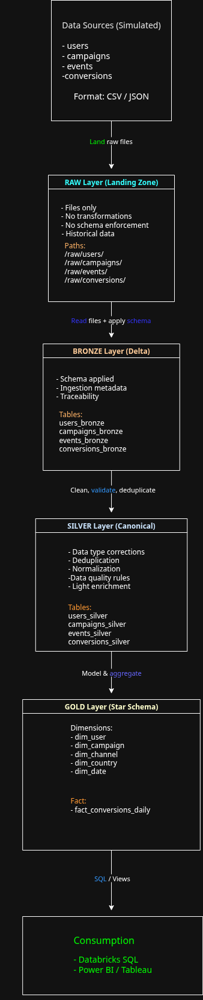

# **Lakehouse Marketing Analytics**

End-to-end Lakehouse pipeline with RAW &rarr; BRONZE &rarr; SILVER &rarr; GOLD layers,
star schema modeling and BI consuption using Databricks.

---

## Project Overwiew

This project demonstrates a complete Lakehouse architecture built from scratch,
covering data generation, ingestion, transformation, dimensional modeling and BI consumption.

The main goal is to simulate real-world data engineering challenges such as:
- Poor data quality at the source
- Schema enforcement
- Deduplication
- Canonical data modeling
- Analytics-ready star schema

---

## Project Goals

- Design and implement a Lakehouse architeture from scratch
- Simulatte real-world data sources with data quality issues
- Apply best practices for RAW, BRONZE, SILVER and GOLD layers
- Build a star schema optimized for analytics
- Enable BI consumption using SQL and visualization tools

---

## Architecure Overview

The pipeline follow a layered Lakehouse architecture, where each layer has a clear responsibility
and no business rules are applied prematurely.

Flow:

`Data Sources` &rarr; `RAW` &rarr; `BRONZE` &rarr;  `SILVER` &rarr;  `GOLD` &rarr; `BI`

### **RAW Layer**

- Stores raw files (CSV / JSON)
- No transformations or validations
- Represents the source system as-is

### **BRONZE Layer**

- Delta tables with explicit schema
- Ingestion metadata for traceability
- No business logic applied

### **GOLD Layer**

- Analytics-ready data
- Star schema modeling
- Fact and dimension tables
- Optimized for BI consumption

---

## Data Model

The GOLD layer follows a star schema design.

Dimensions:

- dim_user
- dim_campaign
- dim_channel
- dim_country
- dim_date

Fact:

- fact_conversions_daily

The fact table is aggregated at the following grain:

campaign + date + channel + country

---

## Technologies Used

- Databricks
- Apache Spark (PySpark & Spark SQL)
- Delta Lake
- Python
- Faker (data generation)
- Power BI / Tableau (consumption)

---

## How to Run

1. Generate source data using notebooks in `00_generate_data`
2. Land raw files in the RAW layer
3. Ingest data into BRONZE Delta tables
4. Apply transformations to SILVER
5. Build star schema in GOLD
6. Query GOLD layer using SQL or connect to BI tools

---

## What This Project Demonstrates

- Real-world data engineering thinking
- Proper separation of concerns between layers
- Data quality and traceability
- Dimensional modeling for analytics
- End-to-end ownership of a data pipeline
